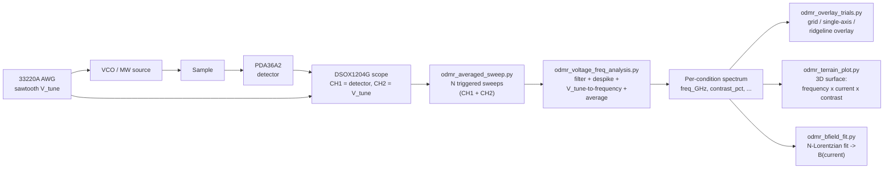

# ODMR Averaged Sweep

Data-collection and analysis pipeline for an optically detected magnetic
resonance (ODMR) measurement: sweep a microwave drive frequency across a
resonance and look for the fractional dip in fluorescence, analogous to
Zhang et al., *Am. J. Phys.* 86, 225 (2018), which reports an ~8%
fluorescence dip on resonance.

## Pipeline overview



`figures/pipeline_diagram.png` is a static, compact rendering of the
acquisition -> analysis half of this pipeline (steps 1-2 below), kept for
direct use in reports/papers where Mermaid markdown won't render; it
predates the three cross-condition scripts added below and hasn't been
regenerated to include them.

See the scripts below for the implementation details (CLI flags, exact
filenames, SCPI commands) each stage corresponds to. The acquisition and
analysis scripts (1-2) run once per experimental condition (e.g. one
current/field value, with `FIELD_LABEL` updated between runs);
`odmr_overlay_trials.py`, `odmr_terrain_plot.py`, and `odmr_bfield_fit.py`
(3-5) run once at the end, across every condition's analysis output, to
compare conditions against each other.

`odmr_diagnose_ch2.py` sits outside the main pipeline - it's a standalone,
read-only sanity check against the live scope, used to diagnose trigger/
voltage-range problems without risking any acquisition run.

## Setup

- **PDA36A2** photodetector/amplifier — fluorescence-proportional signal, read
  on scope **CHAN1**.
- **Keysight 33220A** function generator — drives a sawtooth ramp (`V_tune`)
  into a VCO to sweep the microwave frequency; also monitored on scope
  **CHAN2**.
- **Keysight DSOX1204G** oscilloscope — captures both channels together, one
  triggered single-shot acquisition (`:DIGITIZE`) per sweep.

### Drivers (required before either instrument shows up over USB)

Install **both** of the following before `odmr_averaged_sweep.py` or
`odmr_diagnose_ch2.py` can find the scope/AWG over PyVISA - `pyvisa-py`
alone is not enough for USB-TMC instrument discovery on Windows:

- [Keysight IO Libraries Suite](https://www.keysight.com/find/iosuite) —
  provides the VISA runtime and USB drivers for the DSOX1204G and 33220A.
- [NI-VISA](https://www.ni.com/en/support/downloads/drivers/download.ni-visa.html)
  — needed alongside the Keysight suite for both instruments to enumerate
  reliably.

After installing both, confirm the VISA resource strings with NI MAX or
Keysight Connection Expert and update `DEFAULT_SCOPE_ADDR`/`DEFAULT_AWG_ADDR`
(see below) to match.

The scope triggers on CHAN2's rising edge, at a level set with real margin
above the ramp's *actual measured* minimum (not derived from the commanded
amplitude/offset - this 33220A's real CH2 output doesn't track those 1:1),
so every capture starts at the same phase of the sweep. If you change the
sawtooth's amplitude/offset, re-measure CH2 with `odmr_diagnose_ch2.py` and
update `REAL_CH2_VMIN`/`REAL_CH2_VPP` in `odmr_averaged_sweep.py` (or pass
`--trigger-level-v` explicitly), otherwise the trigger can land right in the
ramp reset's noisiest region or miss the real waveform range entirely.

A voltage-to-frequency calibration (`V_TO_F_SLOPE_GHZ_PER_V`,
`V_TO_F_INTERCEPT_GHZ`, defined in both scripts), obtained from band-edge
measurements, converts the sawtooth's tuning voltage into the corresponding
microwave drive frequency.

## Scripts

See the [Pipeline overview](#pipeline-overview) diagram above for how these
fit together.

### 1. `odmr_averaged_sweep.py` — acquisition

Configures the AWG and scope, then loops `--runs` triggered single-shot
acquisitions of CHAN1 (+ CHAN2), recording each run's max/min and (with
`--save-traces`) every raw sample.

```
pip install pyvisa pyvisa-py numpy
python odmr_averaged_sweep.py --runs 1000 --waveform ramp --ampl-vpp 1.5 --offset-v 4.0 --save-traces
```

Notable flags (run `--help` for the full list, grouped by instrument
address / function generator / scope channels / acquisition-trigger):

- `--ch1-headroom` (default 4.0) widens CH1's autoscaled range after
  autoscaling, so a rare large transient records at its true amplitude
  instead of clipping.
- `--trigger-source`/`--trigger-level-v`/`--trigger-slope` default to a
  CHAN2-synced rising edge with margin above the real measured minimum (see
  Setup above).
- `--min-record-length` (default 10000) and `--time-per-record-s` (default:
  derived from `--freq-hz` to capture slightly less than one ramp period)
  control per-sweep resolution.
- `--no-change-pulse` leaves the AWG's current output untouched instead of
  reconfiguring it at startup.
- Ctrl-C stops early and still saves whatever was captured.

Update `DEFAULT_SCOPE_ADDR`/`DEFAULT_AWG_ADDR` at the top of the script (or
pass `--scope-addr`/`--awg-addr`) for your VISA resource strings.

### 2. `odmr_voltage_freq_analysis.py` — analysis

Reads a raw-traces CSV from step 1 (`--input`), optionally filters out bad
sweeps, despikes CH1, converts each sweep's CH2 voltage to frequency via a
linear fit (not the raw per-sample value - see the script's docstring for
why), interpolates every sweep onto a common frequency grid, and averages.

```
pip install numpy matplotlib
python odmr_voltage_freq_analysis.py --input "csv_output/ODMR_Trace_0A_N1000_091526_1627.csv"
```

Notable flags:

- `--min-diff-mv` / `--max-jump-mv` filter out sweeps with too small a
  max-min range, or an irregular single-sample spike, respectively.
  `--diagnostic-traces` plots a sample of kept vs. discarded sweeps so a
  filter's effect can be inspected rather than taken on faith.
- `--despike-window`/`--despike-threshold-mv` control the rolling-median
  outlier filter applied within kept sweeps (distinct from `--max-jump-mv`,
  which rejects a whole sweep).
- `--normalize-per-run` rescales each sweep to its own mean before
  averaging, to cancel sweep-to-sweep gain/offset drift (off by default -
  see the script's docstring for a caveat on when this helps vs. distorts).
- `--grid-points` sets the common frequency grid's resolution.

The `--input` default currently points at a filename from an older naming
convention and won't exist - always pass `--input` explicitly.

### 3. `odmr_overlay_trials.py` — cross-condition overlay

Reads every condition's analysis-output spectrum CSV from step 2 (one per
immediate subfolder of `--base-dir`, auto-discovered and sorted by the
numeric value in the folder name, e.g. `0.300A` -> 0.3) and produces three
figures comparing `contrast_pct` vs. `freq_GHz` across all of them, since raw
voltage isn't comparable across conditions (autoscale/gain differs run to
run) but the normalized contrast is:

```
pip install numpy matplotlib
python odmr_overlay_trials.py --base-dir "csv_output/09172026 Outputs"
```

- **Grid** (`odmr_overlay_grid_<base-dir>.png`) — one small-multiple panel
  per condition, sharing a y-scale so shrinking/splitting dip depth reads
  directly panel to panel, with the x-axis auto-cropped (`--feature-frac`)
  to each condition's own feature region so flat baseline doesn't dominate.
- **Single-axis overlay** (`odmr_overlay_single_<base-dir>.png`) — every
  condition on one shared frequency axis, color-coded on an ordinal blue
  ramp with a colorbar; best for comparing absolute frequency alignment
  across conditions.
- **Ridgeline** (`odmr_overlay_ridgeline_<base-dir>.png`) — every condition
  stacked vertically with a per-condition offset and direct end-labels, on
  the *full* swept frequency range but a narrow figure width, so each dip's
  depth-to-width ratio reads larger without cropping any data out of view.

Conditions are colored on a single-hue sequential ramp (light = low value,
dark = high value), not a per-line legend, since they're a numerically
ordered physical quantity (e.g. increasing current) - see the project's
dataviz conventions in the script's own docstring.

### 4. `odmr_terrain_plot.py` — 3D contrast surface across frequency and current

Builds a `matplotlib` 3D surface (frequency x current x `contrast_pct`) from
the same per-condition spectrum CSVs, reusing `odmr_overlay_trials.py`'s
condition-loading code:

```
pip install numpy scipy matplotlib
python odmr_terrain_plot.py --base-dir "csv_output/09172026 Outputs" --output png_output/odmr_terrain.png
```

Each condition's spectrum is linearly interpolated (`np.interp`) onto one
shared frequency grid, clipped to the *intersection* of every condition's
measured range so nothing is extrapolated. The current axis is left at its
real, non-uniformly-spaced sample points (e.g. 0A, 0.100A, ... 0.900A) -
`plot_surface` connects adjacent measured rows with flat bilinear patches
only, so nothing between conditions is smoothed or fabricated. Notable
flags: `--n-freq-points` (mesh resolution along frequency), `--alpha`
(surface transparency, so far-side structure remains visible), `--elev`/
`--azim` (3D view angle).

### 5. `odmr_bfield_fit.py` — per-condition Lorentzian fit and B-field extraction

Fits each condition's spectrum to a sum of `N` Lorentzian dips (the lab
handout's Eq. 5 two-Lorentzian model, generalized to however many dips
`scipy.signal.find_peaks` actually resolves in that condition - a fixed
2-line fit works at low current but degenerates once more than 2 dips
resolve at higher field), then converts the outermost pair of fitted line
centers into a magnetic field via the NV Zeeman relation, and compares that
measured field to a theoretical solenoid end-field calculation:

```
pip install numpy scipy matplotlib
python odmr_bfield_fit.py --base-dir "csv_output/09172026 Outputs" --coil-length-cm <winding length>
```

- `--coil-turns` (default 470), `--coil-diameter-cm` (default 3.2),
  `--coil-length-cm` (no default - required to draw the theoretical
  B-vs-current line at all) parameterize the electromagnet coil; the field
  is evaluated at the coil's *end* (`solenoid_end_field_mt`), not its
  center, since the sample sits there.
- `--zero-label` (default `0A`) identifies which condition's fit supplies
  the zero-field strain splitting `E` used as the reference for every other
  condition's field extraction.
- `--max-lines` caps how many Lorentzian lines a single condition's fit can
  use, so noise wiggles don't get chased as if they were real transitions.

Outputs: a per-condition fit-quality grid (`odmr_bfield_fits_<base-dir>.png`,
data vs. fit with `N` and `R²` annotated per panel), the measured-vs-theory
comparison plot (`odmr_bfield_vs_current_<base-dir>.png`), and a CSV
(`odmr_bfield_fit_<base-dir>.csv`) with every fitted parameter (`C`, `D`,
`E`, `Gamma`, line count, `R²`, `B_measured_mT` with propagated uncertainty)
per condition. See the script's own docstring for the physical reasoning
behind fitting an adaptive line count and using the outermost pair for `B`.

### 6. `odmr_diagnose_ch2.py` — standalone diagnostic

Read-only: connects to the scope and prints CH2's live measured voltage
(Vpp/Vmax/Vmin/Vavg), coupling, and the currently configured trigger
settings, without changing anything. Useful for re-measuring CH2's real
range after changing the sawtooth's amplitude/offset, or for debugging a
scope trigger stuck on "Auto" (not finding a valid edge).

```
python odmr_diagnose_ch2.py
```

## Output

`odmr_averaged_sweep.py` and `odmr_voltage_freq_analysis.py` both write into
a per-condition subfolder, `csv_output/<FIELD_LABEL>/` (and
`png_output/<FIELD_LABEL>/` for the analysis script), where `FIELD_LABEL` is
a constant in each script's source that must be kept in sync between the two
scripts and edited before a run at a different experiment condition (e.g.
`"0.300A"`). Within that folder, filenames are
`ODMR_Trace_<field>_N<n>_<MMDDYY>_<HHMM>[.csv|.png]`, where `<n>` is the
actual number of runs/sweeps used - so every output file's name says what's
in it without manual renaming.

- **Acquisition** (`odmr_averaged_sweep.py`), in `csv_output/<FIELD_LABEL>/`:
  - `..._summary.csv` — `run_index, ch1_max_V, ch1_min_V, diff_mV` per run.
  - `....csv` (with `--save-traces`) — `run_index, time_s, ch1_V, ch2_V` for
    every sample of every run; this is what `odmr_voltage_freq_analysis.py`
    takes as `--input`.
- **Analysis** (`odmr_voltage_freq_analysis.py`):
  - `....csv` (`csv_output/<FIELD_LABEL>/`) — `freq_GHz, detector_V_avg,
    detector_V_sd, contrast_pct, relative_noise_pct` for every point on the
    common frequency grid; this is what the three cross-condition scripts
    below read (one such CSV per condition folder).
  - `....png` (`png_output/<FIELD_LABEL>/`) — averaged detector output vs.
    drive frequency, with a ± SD band.
  - `..._kept_vs_discarded.png` — diagnostic plot of sample kept vs.
    discarded raw traces (only produced when a filter actually excludes
    sweeps).
- **Cross-condition** (`odmr_overlay_trials.py`, `odmr_terrain_plot.py`,
  `odmr_bfield_fit.py`), written directly to `csv_output/`/`png_output/`
  (not per-condition, since these read *across* every `FIELD_LABEL` folder)
  and named after `--base-dir`'s own folder name — see each script's section
  above for its exact output filenames.

Raw per-sample traces routinely reach hundreds of MB to multiple GB (well
past GitHub's 100 MB file limit) - `.gitignore` excludes anything matching
`csv_output/*traces*.csv` and any `Old Runs/` archive folder, but the current
`ODMR_Trace_*` naming can't distinguish a huge raw-traces file from a small
analysis output by name alone, so double-check before `git add`-ing a large
capture.

## Results

See [`RESULTS.md`](RESULTS.md) for a walkthrough of every cross-condition
figure this pipeline has produced so far - how each was generated and what
it shows about the field-dependence of the ODMR resonance.
