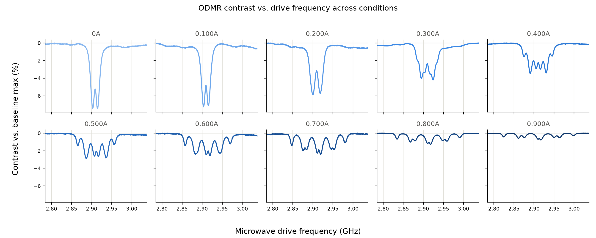
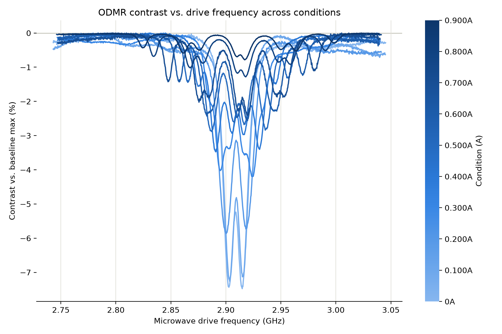
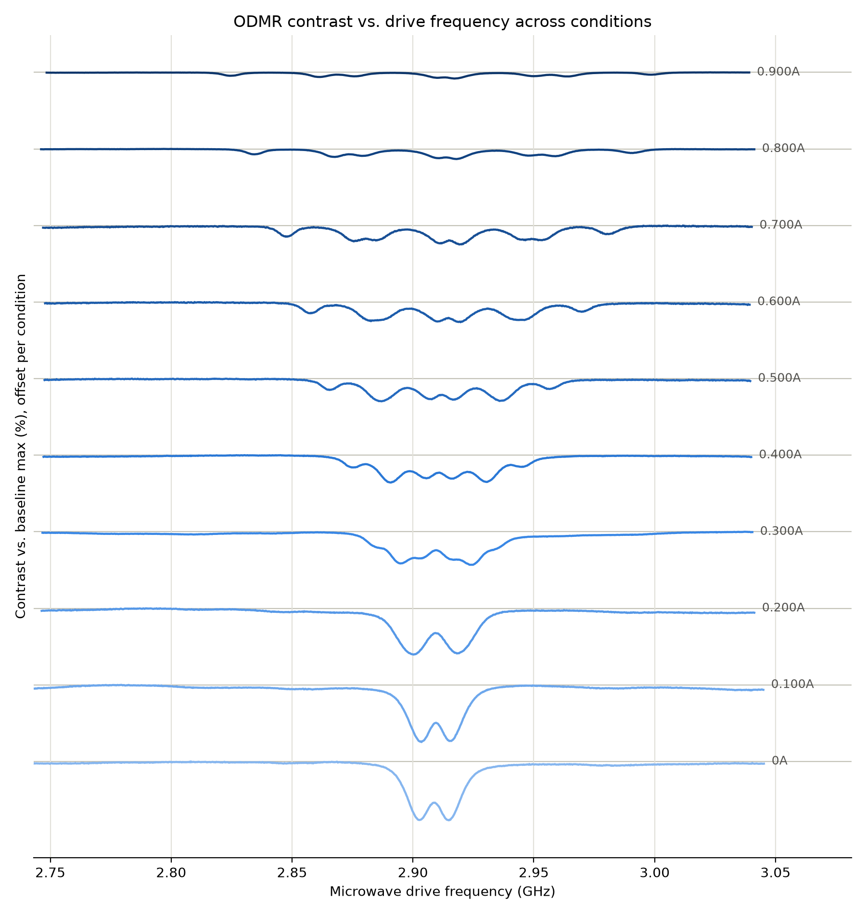
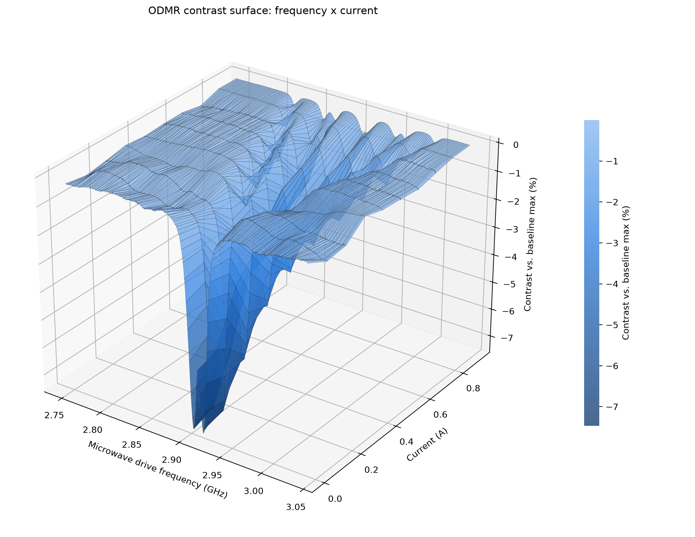
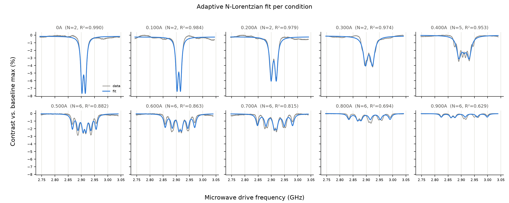
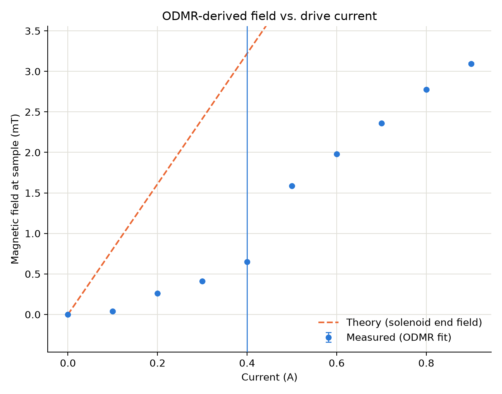

# Results

Walkthrough of every cross-condition figure produced by this pipeline, from
the 10-condition sweep in `csv_output/09172026 Outputs/` (0A through 0.900A
in 0.100A steps, N=1000 real triggered sweeps per condition). Each figure's
section says which script made it, exactly how, and what it shows.

All figures here are generated from real captured data
(`odmr_averaged_sweep.py` -> `odmr_voltage_freq_analysis.py`), not synthetic
or illustrative data - see the main [`README.md`](README.md) for the
acquisition/analysis pipeline these figures are built on top of.

## Overlay: small-multiples grid

**How:** `python odmr_overlay_trials.py --base-dir "csv_output/09172026 Outputs"`.
One panel per condition, sharing a y-scale so contrast is directly
comparable panel to panel; the x-axis is auto-cropped to the union of each
condition's own feature region (not hardcoded), so the flat baseline on
either side of the resonance doesn't dominate a small panel.

**What it shows:** the resonance dip depth shrinks monotonically as current
increases - from -7.48% at 0A down to -0.78% at 0.900A - while simultaneously
splitting from a single symmetric double-dip (0A-0.300A) into progressively
more resolved sub-structure (5-6 distinct lines by 0.400A-0.900A). Depth and
splitting both changing together, smoothly and monotonically across 9
independently-captured conditions, is the signature of a real field-induced
Zeeman effect rather than noise or a measurement artifact.

## Overlay: single-axis comparison

**How:** same script and run as above; this is the second of its three
output figures. All 10 conditions plotted on one shared frequency axis,
color-coded light-to-dark blue by current (colorbar, not a per-line legend -
a legend with 10 swatches is hard to match to lines by eye, and current is
an ordered physical quantity, so color-as-position is the right encoding).

**What it shows:** the same trend as the grid, but makes the *frequency
alignment* directly comparable across conditions - all dips are centered
close to 2.90-2.91 GHz regardless of current, confirming the splitting is
happening symmetrically around a fixed zero-field-splitting center rather
than the whole resonance drifting.

## Overlay: ridgeline

**How:** third output of the same `odmr_overlay_trials.py` run. All 10
conditions stacked vertically on one axis with a per-condition offset and a
direct end-label, over the *full* swept frequency range but a narrow figure
width (a physical squeeze, not a data crop) so each dip's depth-to-width
ratio reads larger.

**What it shows:** the clearest top-to-bottom view of the progression - 0A
and 0.100A both show a single, deep, cleanly-split double dip; by 0.500A the
resonance has visibly fanned out into a wide multi-line structure; by
0.800A-0.900A the remaining features are shallow and broad, consistent with
the outer (field-aligned) and inner (off-axis) NV populations continuing to
separate while each individual line's contrast drops with current.

## 3D terrain: frequency x current x contrast

**How:** `python odmr_terrain_plot.py --base-dir "csv_output/09172026 Outputs"`.
Each condition's spectrum is linearly interpolated onto one shared frequency
grid (clipped to the intersection of every condition's measured range, never
extrapolated) and rendered as a `matplotlib` surface across the 10 real
current values. Adjacent measured current rows are connected by flat
bilinear patches only - nothing between conditions is smoothed or
fabricated. Color is a sequential blue ramp on contrast magnitude (light =
near zero, dark = deepest dip).

**What it shows:** the same trend as the overlay figures, but as one
continuous surface - a single deep, narrow trench at 0A/0.100A that widens
and shallows into a rippled, multi-ridged shelf by 0.900A. The 3D framing
makes the trade-off between depth and width especially visible: the
resonance's total "area" (roughly, integrated contrast) drops much faster
than its peak depth alone would suggest, since the dip is also spreading
across a wider frequency range as it splits.

## Lorentzian fits per condition

**How:** `python odmr_bfield_fit.py --base-dir "csv_output/09172026 Outputs" --coil-length-cm 3.3`.
Each condition is fit to a sum of `N` Lorentzian dips, where `N` is however
many `scipy.signal.find_peaks` actually resolves in that spectrum (2 at low
current, up to 6 at high current) - not a fixed 2-line model, which turned
out to fit badly once more than 2 real dips are present (see the script's
docstring for the two failed fixed-line approaches this replaced: a
prominence-seeded 2-line fit that just drifted instead of widening, and an
outer-pair-seeded 2-line fit that collapsed into two unrealistically narrow
spikes). Contrast `C` and linewidth `Gamma` are shared across every line in
a condition, matching the lab handout's model structure.

**What it shows:** the fit (blue) tracks the real multi-dip structure (gray)
at every current, with `R²` ranging from 0.99 (0A, cleanly 2 lines) down to
0.63 (0.900A, 6 overlapping lines) - degrading gracefully as the spectrum
gets more complex, rather than collapsing the way a fixed-line-count fit
did. The `N` and `R²` annotated on each panel are a direct, honest measure of
how well that condition's fit should be trusted.

## Measured vs. theoretical magnetic field

**How:** same run as above. The outermost two fitted line centers in each
condition (which the lab handout's Eq. 2 identifies as the NV population
whose axis is aligned with the field, seeing the *full*, unreduced
splitting) are converted to a magnetic field via `nu_+ - nu_- =
2*sqrt(E^2 + (gamma_e*B)^2)`, with the strain term `E` taken from the 0A
condition's own fit. The theoretical line is the on-axis field at the end of
a finite solenoid (470 turns, 3.3 cm winding length, 3.2 cm tube diameter -
the sample sits at the coil's end, not its center, so the field is evaluated
there, at half the long-solenoid interior value).

**What it shows:** the measured field grows smoothly and monotonically from
0 to about 3.1 mT across 0-0.900A, but stays well below the naive
solenoid-theory line (which reaches roughly 7 mT at 0.900A) - a
factor-of-2-to-3 discrepancy that grows with current. Candidate explanations
worth checking against the actual setup: the sample may not sit exactly
flush with the coil's physical end (a few mm of standoff drops the field
quickly for a coil this short), the coil's true winding length/turn count
may differ slightly from the assumed 3.3 cm / 470 turns, or there may be a
systematic field-angle effect (the model assumes the field is purely
axial/parallel to the coil, matching the outer NV population's projection
factor of 1). This gap is a genuine, reportable result, not a fitting
artifact - see the R² values above, which show the underlying fits
themselves are trustworthy at every current.
